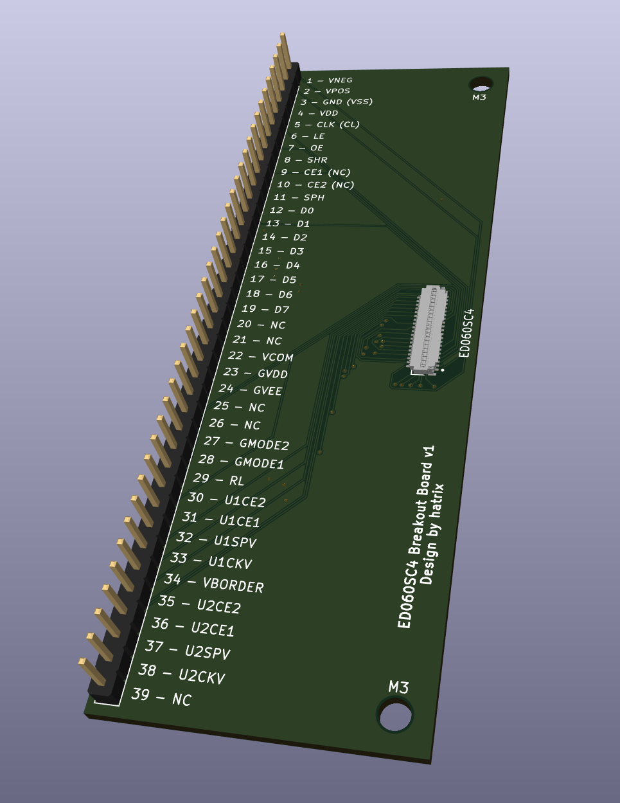
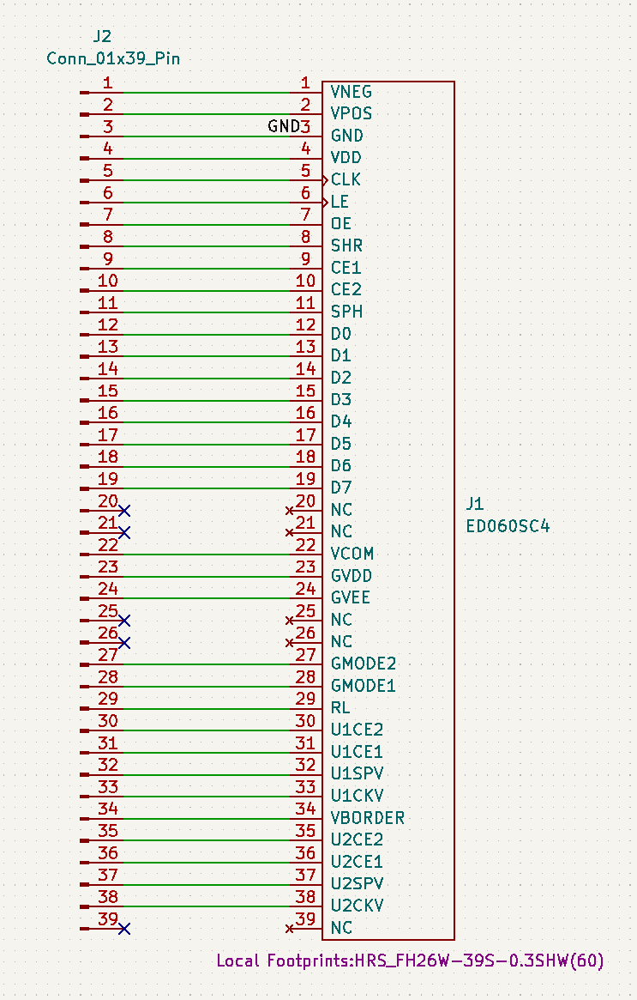

# ED060SC4 Breakout Board

This PCB is intended as a breakout board for the connector of the epaper screen ED060SC4.
This simple board has been inspired by [EPDiy](https://github.com/vroland/epdiy), where the
symbol and footprint for the connector come from. 

# Images

- 3D View

- Schematic

# Making the board

## Buying Components

Only two components are needed:
- The screen connector
- Headers

The screen connector is manufactured by Hirose and can be found under the
reference `FH26W-39S-0.3SHW`, for example on 
[LCSC](https://www.lcsc.com/product-detail/FFC-FPC-Connectors_HRS-Hirose-FH26W-39S-0-3SHW-60_C92280.html).

The headers have a standard pitch of 2.54mm and can be easily found on aliexpress for a cheap price.
The style is at your convenience, you're probably going to have to choose between male pin headers 
or female socket headers, as described on [Wikipedia](https://en.wikipedia.org/wiki/Pin_header)

## Having the board manufactured

The [gerbers file](./gerbers/gerbers.zip) can be directly uploaded on manufacturers' websites.

JLCPCB has a special price (at the time of writing, 2023-04-01) on boards smaller than
102x102 mm. This breakout board falls just under this condition, making the price
quite interesting.
At the time of writing, 5 of those board cost 1.88€ on JLCPCB + shipping.
